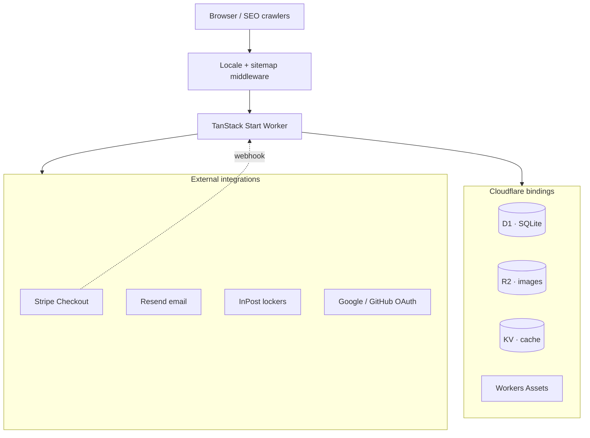
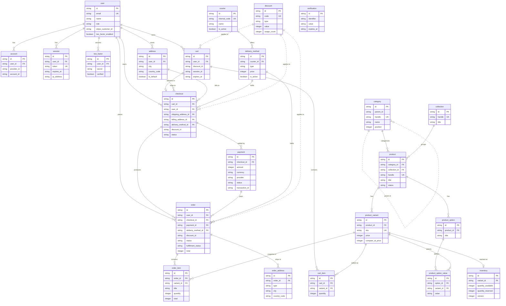

# M'Arte Jewellery

Edge-native e-commerce for a premium jewellery brand (Poland): storefront, multi-step checkout, customer accounts, and admin dashboard on Cloudflare Workers.

The codebase uses modular domain boundaries, strict TypeScript, and live Stripe payment flows. Work is ongoing — commerce paths persist to D1; some admin and account views still read transitional mock modules under `src/data/` while CRUD is wired to the database.

|                |                                                                                                            |
| -------------- | ---------------------------------------------------------------------------------------------------------- |
| **Preview**    | [martebizuteria-preview.pjborowiecki.workers.dev](https://martebizuteria-preview.pjborowiecki.workers.dev) |
| **Production** | [martebizuteria.pjborowiecki.workers.dev](https://martebizuteria.pjborowiecki.workers.dev)                 |
| **Stack**      | TanStack Start · React 19 · Cloudflare Workers · D1 · Drizzle · Stripe · Better Auth                       |
| **Author**     | [Piotr Borowiecki](https://pjborowiecki.com)                                                               |

---

## Overview

- **Edge-first** — one codebase: SSR, server functions, and webhooks on Cloudflare Workers.
- **Domain modules** — `product`, `order`, `checkout`, `inventory`, … each with schemas, accessors, and validation at the boundaries.
- **Platform constraints** — D1 batch writes, optimistic inventory locking, Worker-level i18n middleware where interactive transactions are unavailable.
- **Environments** — preview and production Workers, GitHub Actions deploys, typed bindings, versioned migrations.

Core logic: `**src/modules/`**, third-party adapters: `**src/integrations/**`, payment fulfilment: `**src/integrations/stripe/stripe.webhooks.tsx\*\*`.

---

## Screenshots

Landing

Menu

Products

Product detail

Collections

Sign in

Cart

Checkout

---

## Notable implementation details

| Area                     | Detail                                                                                                                                                               |
| ------------------------ | -------------------------------------------------------------------------------------------------------------------------------------------------------------------- |
| **Checkout & payments**  | Multi-step checkout form → Stripe Checkout Sessions (embedded) → signed webhooks → order creation, inventory fulfilment, and localized confirmation email via Resend |
| **Inventory**            | Optimistic concurrency with version guards; compensating release on partial reservation failure (D1 has no interactive transactions)                                 |
| **Auth & authorization** | Better Auth on D1 + KV; OAuth (Google, GitHub); 2FA; role-based admin access (`admin` / `manager` / `support`) with resource-level permissions                       |
| **Internationalization** | Locale resolved at the Worker edge (`/{locale}/…` routes, cookie persistence, 301 canonicalization) before TanStack Start handles the request                        |
| **Data layer**           | Drizzle ORM with prepared statements where D1 allows; 30+ versioned SQL migrations; UUID v7 IDs; Zod v4 at API and form boundaries                                   |
| **Images & performance** | R2-backed assets, Unpic transforms, route-loader image prefetch service, GSAP + Lenis on the luxury landing experience                                               |
| **Tooling**              | Vite+ unified toolchain (`vp`) — Rolldown build, Oxlint/Oxfmt, Vitest; import order and formatting enforced in `vite.config.ts`                                      |
| **CI/CD**                | PR preview deploys with secret sync and comment bot; production deploy on `main` with environment-scoped Cloudflare resources                                        |

---

## System architecture



**Request path:** `src/server.ts` wraps the TanStack Start handler — serving `/sitemap.xml`, running locale detection/redirect, then delegating to SSR with Cloudflare `env`, `waitUntil`, and `passThroughOnException` in request context.

**Binding surface** (see `wrangler.jsonc`):

| Binding  | Type   | Role                                              |
| -------- | ------ | ------------------------------------------------- |
| `DB`     | D1     | Relational data — catalog, orders, auth, checkout |
| `IMAGES` | R2     | Product and marketing media                       |
| `CACHE`  | KV     | Better Auth secondary storage, edge cache         |
| `ASSETS` | Static | Files in `public/`                                |

**Environments**

| Wrangler env                  | Worker                   | D1 database              |
| ----------------------------- | ------------------------ | ------------------------ |
| `preview` (local dev default) | `martebizuteria-preview` | `martebizuteria-preview` |
| `production`                  | `martebizuteria`         | `martebizuteria`         |

Smart placement and Workers observability are enabled. Secrets (Stripe, Resend, OAuth, auth) are injected via Wrangler — never committed; see `.env.example` for local variable names.

---

## Domain model & code organization

Business logic lives in `**src/modules/`\*\* — one folder per aggregate, consistently structured:

```
modules/<domain>/
  *.schema.ts      # Drizzle table definitions
  *.accessors.ts   # Database reads/writes (prepared statements, batch ops)
  *.queries.ts     # TanStack Query options + createServerFn handlers
  *.zod.ts         # Input/output validation
  *.types.ts       # Shared TypeScript types
```

**Modules in production use today include:** `product`, `product-variant`, `category`, `collection`, `inventory`, `cart`, `checkout`, `order`, `order-item`, `order-address`, `payment`, `delivery-method`, `courier`, `address`, `user`, `session`, `account`, `verification`, `two-factor`, `discount`, and related option/value tables.

**Integration adapters** (`src/integrations/`) isolate third parties from domain code:

- `stripe/` — Checkout Sessions, server actions, webhook handlers, typed error codes
- `better-auth/` — server/client auth, permissions, rate limits, email hooks
- `resend/` — React Email templates (verify, reset password, change email, order confirmation)
- `drizzle-orm/` — database client, schemas barrel, migrations
- `inpost/` — Paczkomaty locker search (public Points API)
- `use-intl/` — message loading, locale middleware, query options

**Routes** (`src/routes/`) stay thin: loaders, head metadata, and composition — no business rules inline.

---

## Database schema (ERD)

All tables are defined with Drizzle in `src/modules/<domain>/*.schema.ts` (D1/SQLite). Solid lines are enforced foreign keys; dashed lines are application-level references (no FK constraint) — the `discount_id` columns on `cart`, `checkout`, and `order`, and the self-referential `category.parent_id`.



---

## Critical flows

### Checkout → payment → fulfilment

1. Customer completes a **multi-step checkout** (contact, delivery method, InPost locker or in-store pickup, billing, Stripe payment).
2. `**createStripeSession`** server function validates cart lines against live D1 inventory, reserves stock (optimistic concurrency), persists checkout + addresses via **D1 batch API\*\*, and creates a Stripe Checkout Session with line items and metadata.
3. Stripe webhook (`checkout.session.completed`, refunds, disputes) verifies signatures, resolves the session → payment row, and calls `**checkoutAccessors.fulfillCheckout`\*\* to create the order and decrement inventory.
4. **Order confirmation email** is sent best-effort (failure is logged, never thrown — payment state remains authoritative).

Relevant entry points: `src/integrations/stripe/stripe.actions.ts`, `src/modules/checkout/checkout.accessors.ts`, `src/integrations/stripe/stripe.webhooks.tsx`.

### Authentication & admin access

- Email/password, **Google & GitHub OAuth**, email verification, password reset, **two-factor authentication**, anonymous sessions, multi-session management.
- **Admin plugin** with custom resource statements for orders, products, and settings.
- Roles: `admin`, `manager`, `support`, `user` — enforced via Better Auth access control (`auth.permissions.ts`).
- Rate limiting and KV-backed session cache; trusted IP from `cf-connecting-ip`.

### Storefront & i18n

- Published catalog (products, categories, collections) loaded from **D1** via TanStack Query + server functions.
- Locales: `**pl`** (default) and `**en\*\*`—`use-intl`with JSON message catalogs in`messages/`.
- Locale prefix routing, cookie persistence, and SEO-friendly redirects handled before React renders.

---

## Feature status

| Capability                                      | Implementation                                                                  |
| ----------------------------------------------- | ------------------------------------------------------------------------------- |
| Product catalog (storefront)                    | ✅ D1 + Drizzle                                                                 |
| Categories & collections (storefront)           | ✅ D1                                                                           |
| Cart                                            | ✅ Zustand (client) + server validation at checkout                             |
| Checkout & Stripe payment                       | ✅ End-to-end with webhooks                                                     |
| InPost locker selection                         | ✅ Public API integration                                                       |
| Inventory reservation                           | ✅ Versioned optimistic locking                                                 |
| Order confirmation email                        | ✅ Resend + React Email                                                         |
| Auth (OAuth, 2FA, roles)                        | ✅ Better Auth                                                                  |
| Customer account (profile, addresses, sessions) | ✅ Mostly live; order history partially demo data                               |
| Admin dashboard UI                              | ✅ Built; catalog/orders/customers lists migrating from `src/data/` mocks to D1 |
| Marketing CMS, coupons, audit log UI            | 🚧 UI present; backend wiring in progress                                       |
| R2 product photography                          | 🚧 Schema ready; placeholder images until media upload pipeline is complete     |

`src/` modules and integrations are the **source of truth**. Personal scratch notes (`NOTES.md`) are excluded from documentation tooling via `.graphifyignore`.

---

## Technology stack

### Application

| Layer        | Choices                                            |
| ------------ | -------------------------------------------------- |
| Framework    | TanStack Start, TanStack Router, TanStack Query v5 |
| UI           | React 19, Tailwind CSS 4, Shadcn / Base UI, Lucide |
| Motion       | GSAP, Lenis smooth scroll                          |
| Forms        | React Hook Form, `@hookform/resolvers`, Zod v4     |
| Client state | Zustand (cart), `nuqs` (URL state)                 |
| Maps         | MapLibre / react-map-gl (store locator patterns)   |

### Platform & data

| Layer    | Choices                                                |
| -------- | ------------------------------------------------------ |
| Runtime  | Cloudflare Workers (`nodejs_compat`)                   |
| Database | Cloudflare D1 (SQLite)                                 |
| ORM      | Drizzle ORM + drizzle-kit migrations                   |
| Storage  | Cloudflare R2                                          |
| Cache    | Cloudflare KV                                          |
| Email    | Resend + React Email                                   |
| Payments | Stripe Checkout Sessions + webhooks                    |
| Auth     | Better Auth (Drizzle adapter, admin plugin)            |
| i18n     | use-intl                                               |
| Images   | Unpic, custom prefetch service, R2 CDN (`VITE_R2_URL`) |

### Quality & delivery

| Layer     | Choices                                                                   |
| --------- | ------------------------------------------------------------------------- |
| Language  | TypeScript — `strictNullChecks`, `noUnusedLocals`, `noUnusedParameters`   |
| Toolchain | Vite+ (`vp`) — build, test, lint, format                                  |
| Linters   | Oxlint, Oxfmt                                                             |
| Tests     | Vitest (via `vp test`)                                                    |
| Deploy    | Wrangler + GitHub Actions (`deploy-preview.yml`, `deploy-production.yml`) |
| Types     | `wrangler types` → `src/types/worker-configuration.d.ts`                  |

Currency: **PLN-first** (ISO codes in schema; UI formats in złoty).

---

## CI/CD

| Trigger               | Pipeline                                                                                                   |
| --------------------- | ---------------------------------------------------------------------------------------------------------- |
| Pull request → `main` | Build with `CLOUDFLARE_ENV=preview`, deploy to preview Worker, sync secrets, comment preview URL on the PR |
| Push → `main`         | Production build + deploy to `martebizuteria` Worker                                                       |

Both pipelines use **Bun**, **Vite+ setup action**, and Cloudflare API tokens from GitHub environments — keeping preview and production D1/KV/R2 isolated.

---

## Local development

### Prerequisites

- [Bun](https://bun.sh) 1.3.x
- [Vite+ CLI](https://viteplus.dev) (`vp`) — use `vp` for install, dev, build, test, lint, format
- Cloudflare account + `wrangler login` (remote D1/R2/KV in dev)

### First run

```bash
vp install
cp .env.example .env.local    # fill secrets locally — never commit
bun run cf-typegen              # regenerate Worker binding types
bun run db:migrate              # apply D1 migrations (preview)
bun run db:seed                 # optional seed data
bun run dev                     # http://localhost:3000 (preview env)
```

### Useful scripts

| Script                      | Purpose                                          |
| --------------------------- | ------------------------------------------------ |
| `bun run dev`               | Dev server (`CLOUDFLARE_ENV=preview`)            |
| `vp check`                  | Typecheck (+ fmt/lint when enabled)              |
| `vp test`                   | Vitest                                           |
| `bun run stripe:listen`     | Forward Stripe webhooks → `/api/webhooks/stripe` |
| `bun run db:studio`         | Drizzle Studio (preview DB)                      |
| `bun run deploy:preview`    | Manual preview deploy                            |
| `bun run deploy:production` | Manual production deploy                         |

Agent and contributor conventions: `**AGENTS.md**`. Vendored upstream source for debugging: `**opensrc/**` (see `opensrc/sources.json`).

---

## Repository layout

TanStack Router uses a **flat** `src/routes/` directory — no nested route folders. Path segments, layouts, and params are encoded in filenames (`{-$locale}`, `_storefront`, `$handle`, `index`).

```
martebizuteria/
├── .github/workflows/          # preview + production deploy pipelines
├── messages/                   # use-intl catalogs (en/, pl/ — one JSON module per namespace)
├── public/                     # static assets (favicon, icons, landing video)
│   └── screenshots/            # README UI captures
├── seeds/                      # SQL seed files (catalog, inventory, delivery, …)
├── scripts/                    # commit-msg hook, ad-hoc tooling
├── opensrc/                    # vendored upstream source (see opensrc/sources.json)
├── src/
│   ├── server.ts               # Cloudflare Worker entry (locale middleware, sitemap, SSR)
│   ├── router.tsx              # TanStack Router instance + context
│   ├── routeTree.gen.ts        # generated route tree (do not edit)
│   │
│   ├── routes/                 # all routes — flat, 53+ files, zero subdirectories
│   │   ├── __root.tsx
│   │   ├── dev.emails.tsx      # email template preview (dev)
│   │   ├── api.auth.$.ts       # Better Auth catch-all
│   │   ├── api.webhooks.stripe.ts
│   │   ├── {-$locale}.tsx      # locale layout
│   │   │
│   │   ├── {-$locale}._storefront.tsx              # pathless storefront layout
│   │   ├── {-$locale}._storefront.index.tsx          # /
│   │   ├── {-$locale}._storefront.cart.tsx
│   │   ├── {-$locale}._storefront.products.index.tsx
│   │   ├── {-$locale}._storefront.products.$handle.tsx
│   │   ├── {-$locale}._storefront.categories.index.tsx
│   │   ├── {-$locale}._storefront.categories.$handle.tsx
│   │   ├── {-$locale}._storefront.collections.index.tsx
│   │   ├── {-$locale}._storefront.collections.$handle.tsx
│   │   ├── {-$locale}._storefront.about.tsx
│   │   ├── {-$locale}._storefront.faq.tsx
│   │   ├── {-$locale}._storefront.privacy-policy.tsx
│   │   ├── {-$locale}._storefront.terms-of-service.tsx
│   │   ├── {-$locale}._storefront.exchanges-and-returns.tsx
│   │   │
│   │   ├── {-$locale}.checkout.tsx
│   │   ├── {-$locale}.checkout.index.tsx
│   │   │
│   │   ├── {-$locale}.auth.tsx
│   │   ├── {-$locale}.auth.sign-in.tsx
│   │   ├── {-$locale}.auth.sign-up.tsx
│   │   ├── {-$locale}.auth.forgot-password.tsx
│   │   ├── {-$locale}.auth.reset-password.tsx
│   │   │
│   │   ├── {-$locale}.account.tsx
│   │   ├── {-$locale}.account.index.tsx
│   │   ├── {-$locale}.account.overview.tsx
│   │   ├── {-$locale}.account.profile.tsx
│   │   ├── {-$locale}.account.addresses.tsx
│   │   ├── {-$locale}.account.payment.tsx
│   │   ├── {-$locale}.account.sessions.tsx
│   │   ├── {-$locale}.account.wishlist.tsx
│   │   ├── {-$locale}.account.orders.index.tsx
│   │   ├── {-$locale}.account.orders.$id.tsx
│   │   │
│   │   ├── {-$locale}.admin.tsx
│   │   ├── {-$locale}.admin.index.tsx
│   │   ├── {-$locale}.admin.orders.index.tsx
│   │   ├── {-$locale}.admin.orders.$orderId.tsx
│   │   ├── {-$locale}.admin.customers.index.tsx
│   │   ├── {-$locale}.admin.customers.$id.tsx
│   │   ├── {-$locale}.admin.catalog.tsx
│   │   ├── {-$locale}.admin.catalog.index.tsx
│   │   ├── {-$locale}.admin.catalog.products.index.tsx
│   │   ├── {-$locale}.admin.catalog.products.$handle.tsx
│   │   ├── {-$locale}.admin.catalog.categories.index.tsx
│   │   ├── {-$locale}.admin.catalog.categories.$handle.tsx
│   │   ├── {-$locale}.admin.catalog.collections.index.tsx
│   │   ├── {-$locale}.admin.catalog.collections.$handle.tsx
│   │   ├── {-$locale}.admin.coupons.tsx
│   │   ├── {-$locale}.admin.marketing.tsx
│   │   ├── {-$locale}.admin.content.tsx
│   │   ├── {-$locale}.admin.audit.tsx
│   │   └── {-$locale}.admin.settings.tsx
│   │
│   ├── modules/                # domain layer — one folder per aggregate
│   │   ├── product/            #   *.schema · *.accessors · *.queries · *.zod · *.types
│   │   ├── product-variant/
│   │   ├── product-option/
│   │   ├── product-option-value/
│   │   ├── category/
│   │   ├── collection/
│   │   ├── inventory/
│   │   ├── cart/
│   │   ├── cart-item/
│   │   ├── checkout/
│   │   ├── order/
│   │   ├── order-item/
│   │   ├── order-address/
│   │   ├── payment/
│   │   ├── delivery-method/
│   │   ├── courier/
│   │   ├── discount/
│   │   ├── address/
│   │   ├── user/
│   │   ├── session/
│   │   ├── account/
│   │   ├── verification/
│   │   └── two-factor/
│   │
│   ├── integrations/           # third-party adapters (no domain logic)
│   │   ├── stripe/             # Checkout Sessions, server actions, webhooks, errors
│   │   ├── better-auth/        # server/client, permissions, schemas, utils
│   │   ├── resend/             # config, email previews, React Email templates/
│   │   ├── drizzle-orm/        # database client, schemas barrel, migrations/
│   │   ├── inpost/             # Paczkomaty API client + Zod schemas
│   │   └── use-intl/           # message queries, locale middleware
│   │
│   ├── components/
│   │   ├── shadcn/             # ~54 design-system primitives (button, dialog, sidebar, …)
│   │   └── custom/
│   │       ├── checkout/       # multi-step checkout UI + InPost map/selector
│   │       ├── account/        # customer account widgets
│   │       ├── defaults/       # error / not-found fallbacks
│   │       ├── email-templates/
│   │       ├── product-card.tsx, localized-link.tsx, icons.tsx, …
│   │       └── pages/
│   │           ├── landing-page/   # GSAP sections, Lenis, navigation + fullscreen menu
│   │           ├── product-page/   # PDP layout, gallery, related products
│   │           ├── cart-page/
│   │           ├── auth/           # sign-in, sign-up, OAuth, password flows
│   │           └── admin/          # dashboard, catalog, orders, customers, audit, settings
│   │
│   ├── lib/
│   │   ├── utils.ts            # cn(), locale helpers, sitemap XML, shared re-exports
│   │   ├── gsap.ts             # GSAP plugin registration
│   │   └── _utils/
│   │       ├── locale.ts       # locale parsing / validation
│   │       ├── url.ts          # base URL, asset URLs, redirects
│   │       ├── email.ts        # Resend send wrapper
│   │       ├── image.ts        # R2/Unpic URLs, prefetch service
│   │       ├── images.ts       # image helper variants
│   │       ├── currency.ts     # PLN formatting helpers
│   │       ├── sitemap.ts      # sitemap generation
│   │       ├── ui.ts             # UI utilities
│   │       └── try-catch.ts    # typed result helper
│   │
│   ├── constants/
│   │   ├── index.ts            # CONSTANTS barrel (app name, routes, roles, …)
│   │   ├── types.ts
│   │   └── _constants/         # routes, locales, permissions, stripe, delivery, pages, …
│   │
│   ├── data/                   # transitional mock modules (admin/account UI)
│   │   ├── catalog-data.ts
│   │   ├── categories-data.ts
│   │   ├── collections-data.ts
│   │   ├── orders-data.ts
│   │   ├── order-detail-data.ts
│   │   ├── customers-data.ts
│   │   ├── customer-detail-data.ts
│   │   ├── account-orders-data.ts
│   │   ├── coupons-data.ts
│   │   ├── marketing-data.ts
│   │   ├── content-data.ts
│   │   ├── audit-data.ts
│   │   ├── settings-data.ts
│   │   ├── landing-data.ts
│   │   └── product-data.ts
│   │
│   ├── hooks/                  # use-navigation-logic, use-landing-animations, use-debounce, …
│   ├── providers/              # themes, tooltip, translations
│   ├── stores/                 # cart.store.ts (Zustand)
│   ├── styles/                 # globals.css, fonts.css
│   └── types/                  # worker-configuration.d.ts (Wrangler), vite-env, globals
│
├── wrangler.jsonc              # Worker bindings, preview/production envs
├── vite.config.ts              # Vite+ config (fmt, lint, import order)
├── tsconfig.json
├── package.json
└── .graphifyignore             # excludes opensrc/, NOTES.md from graph scans
```

**Route naming** — TanStack Router file conventions used throughout:

| Token                        | Meaning                                                     |
| ---------------------------- | ----------------------------------------------------------- |
| `{-$locale}`                 | Optional locale prefix (`/pl/…`, `/en/…`)                   |
| `_storefront`                | Pathless layout wrapping public shop pages                  |
| `$handle`, `$id`, `$orderId` | Dynamic URL segments                                        |
| `index`                      | Index route for a path (`products/` → `products.index.tsx`) |
| `api.`\*                     | API routes outside the locale layout                        |

**Module file pattern** — each folder under `modules/` typically contains:

| File             | Role                                                  |
| ---------------- | ----------------------------------------------------- |
| `*.schema.ts`    | Drizzle table definition                              |
| `*.accessors.ts` | Queries and mutations (prepared statements, D1 batch) |
| `*.queries.ts`   | `createServerFn` handlers + TanStack Query options    |
| `*.zod.ts`       | Input/output validation                               |
| `*.types.ts`     | Shared TypeScript types                               |

---

## Conventions

1. **Vendor adapters** — Stripe, Resend, and InPost stay in `src/integrations/`; domain accessors do not import them directly.
2. **Validation at boundaries** — Zod on server functions, checkout forms, and webhook metadata.
3. **Partial-failure handling** — inventory rollback on failed reservation; order email is best-effort after payment succeeds.
4. **Typed platform** — `Env` from `wrangler types`; `waitUntil` for background auth work on Workers.
5. **Mock isolation** — admin seed data in `src/data/` until list/detail routes use D1 accessors.

---

## License & attribution

Source is available under [LICENSE.md](./LICENSE.md) (Creative Commons **BY-NC 4.0**). Third-party names (Cloudflare, Stripe, React, TanStack, etc.) are trademarks of their respective owners.

[Piotr Borowiecki](https://pjborowiecki.com) · [Issues](https://github.com/pjborowiecki/martebizuteria.pl/issues)
