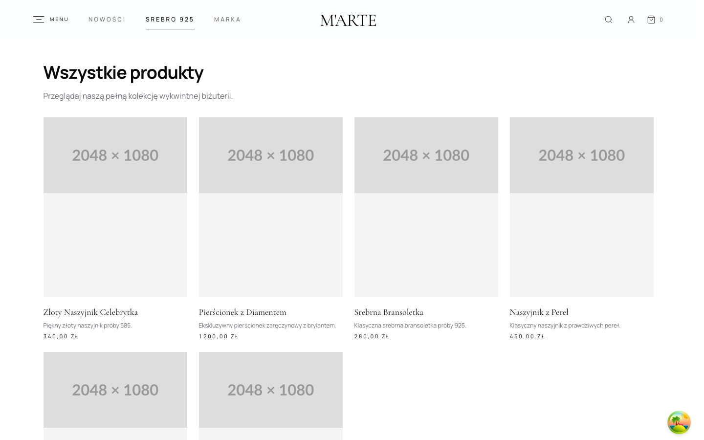
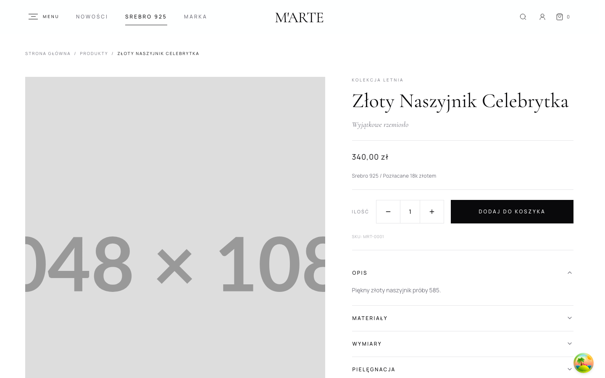
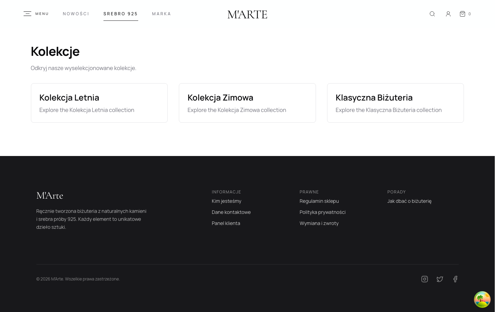
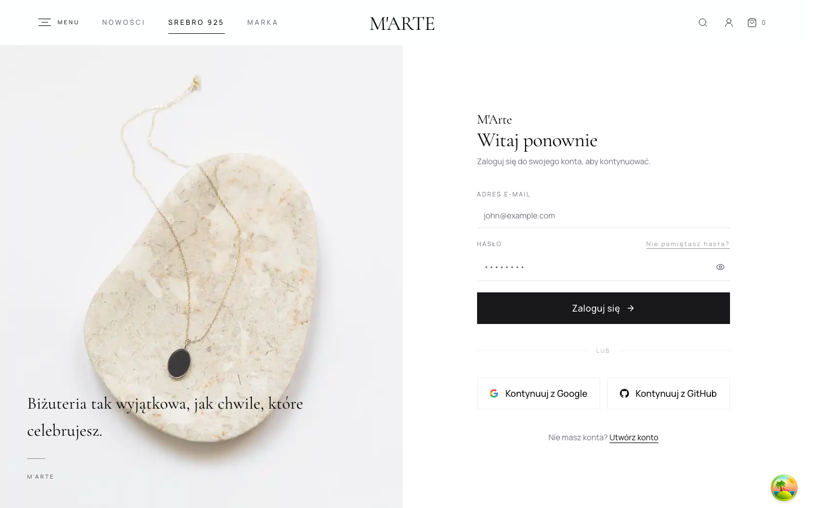
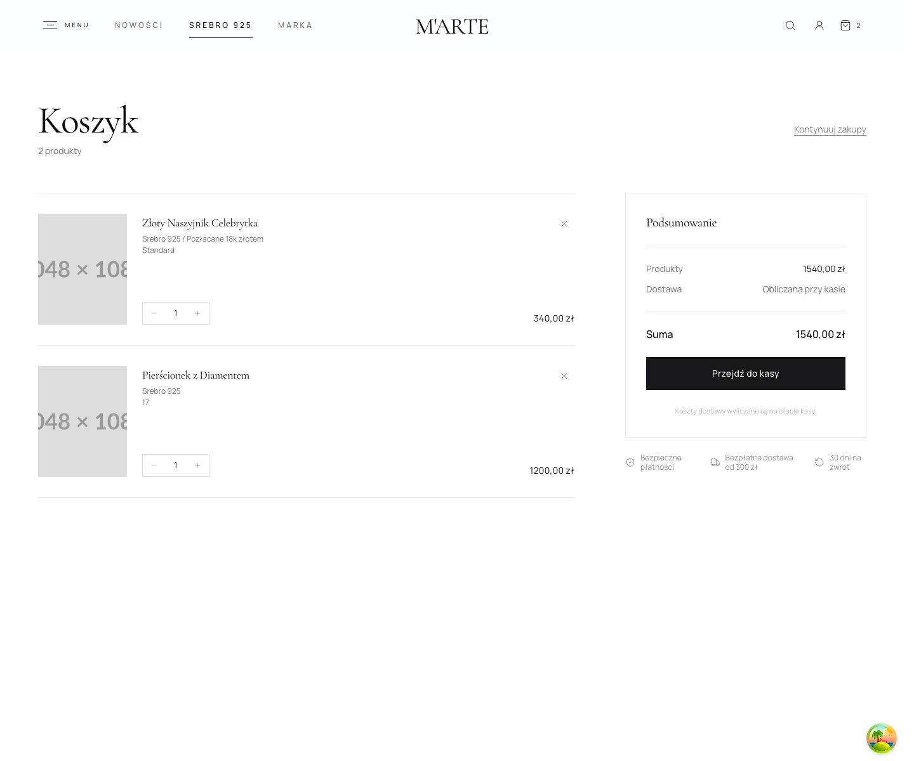
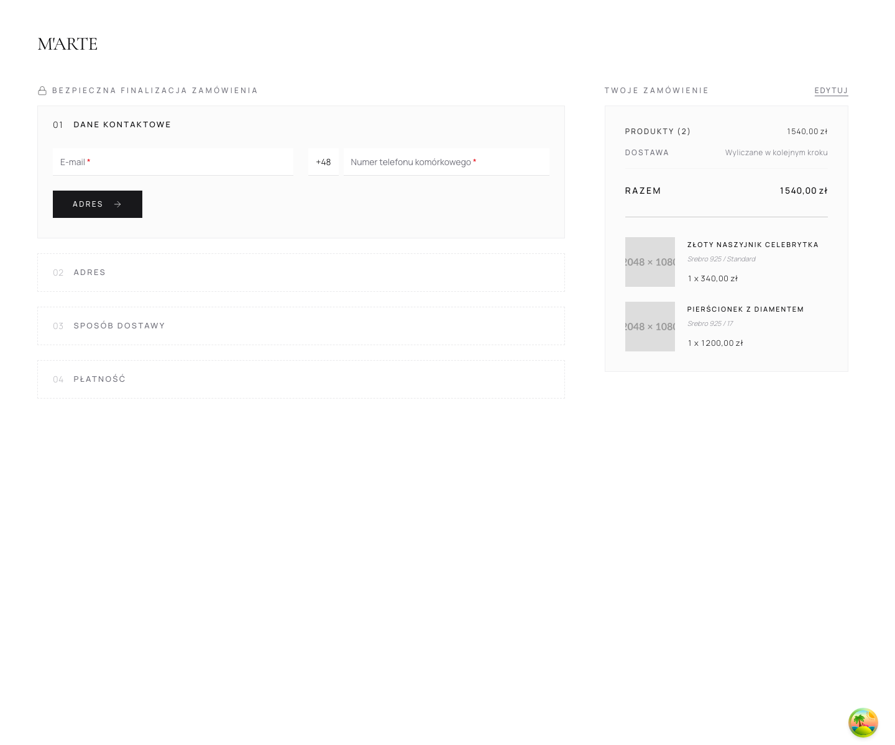
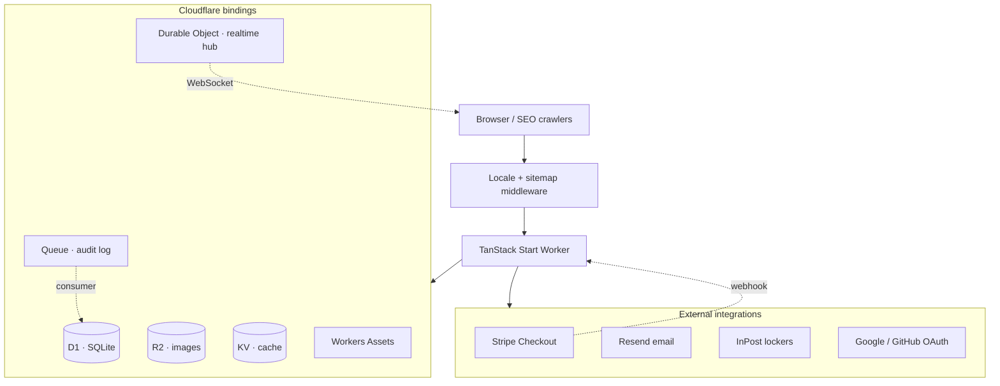
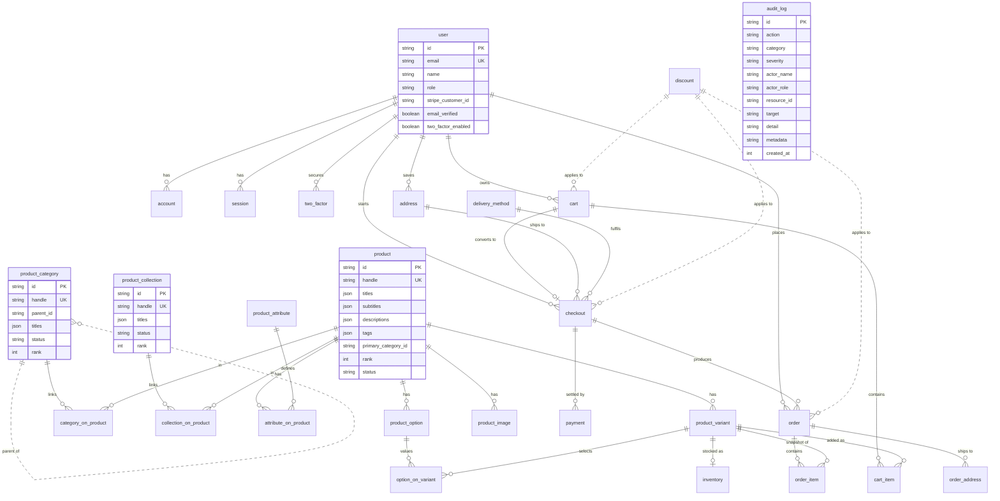

# M'Arte Jewellery

Edge-native e-commerce for a premium jewellery brand (Poland): storefront, multi-step checkout, customer accounts, and admin dashboard on Cloudflare Workers.

The codebase uses modular domain boundaries, strict TypeScript, and live Stripe payment flows. Catalog, customers, and audit logging run on D1 with server-driven admin tables; a shrinking set of admin and account views still use transitional mock modules under `src/data/` while orders, marketing, and settings are wired up.

|                |                                                                                                            |
| -------------- | ---------------------------------------------------------------------------------------------------------- |
| **Preview**    | [martebizuteria-preview.pjborowiecki.workers.dev](https://martebizuteria-preview.pjborowiecki.workers.dev) |
| **Production** | [martebizuteria.pjborowiecki.workers.dev](https://martebizuteria.pjborowiecki.workers.dev)                 |
| **Stack**      | TanStack Start · React 19 · Cloudflare Workers · D1 · Drizzle · Stripe · Better Auth                       |
| **Author**     | [Piotr Borowiecki](https://pjborowiecki.com)                                                               |

---

## Overview

- **Edge-first** — one codebase: SSR, server functions, webhooks, queues, and WebSockets on Cloudflare Workers.
- **Domain modules** — `product`, `order`, `checkout`, `user`, `audit-log`, … each with schemas, accessors, queries, and Zod validation at the boundaries.
- **Platform constraints** — D1 batch writes, prepared statements, optimistic inventory locking, `waitUntil` for background work where interactive transactions are unavailable.
- **Environments** — preview and production Workers, GitHub Actions deploys, typed bindings, 50+ versioned SQL migrations.

Core logic: **`src/modules/`**, third-party adapters: **`src/integrations/`**, payment fulfilment: **`src/integrations/stripe/stripe.webhooks.tsx`**.

---

## Advanced platform features

These are first-class architectural choices, not afterthoughts.

### Real-time admin & storefront cache invalidation

When catalog or customer data changes, connected admin (and storefront) clients invalidate TanStack Query caches **without polling**:

1. A mutation schedules invalidation topics via `publishRealtimeInvalidation()`.
2. A **Durable Object** hub (`RealtimeInvalidationHub`) fans out WebSocket messages to every subscriber in that audience (`admin` or `storefront`).
3. The client hook applies `queryClient.invalidateQueries()` for matching key prefixes.

Entry points: `src/durable-objects/realtime-invalidation-hub.ts`, `src/lib/realtime-invalidation/`, `src/integrations/realtime-invalidation/realtime-invalidation.ws.server.ts`. WebSocket routes are registered in `src/server.ts`.

### Durable audit logging via Queues

Audit events are **never written synchronously on the hot path**. Instead:

1. `scheduleAuditLog()` enqueues a message on `AUDIT_LOG_QUEUE` (Cloudflare Queue).
2. The Worker's `queue` handler (`processAuditLogQueueBatch`) batch-inserts rows into D1.
3. Successful writes trigger real-time invalidation of audit query keys.

Covers auth (login/logout/failures), catalog CRUD, order lifecycle, email delivery, customer activity, and settings changes. Actions are typed in `audit-log.constants.ts`; metadata is JSON-serialized with change diffs for updates.

### Customer activity tracking

Authenticated storefront behaviour (page views, cart item adds, cart abandonment) is recorded as audit events via `customer-activity.record.server.ts` and a lightweight client tracker. Events appear in the admin audit log and customer timelines with actor, IP, and structured metadata.

### Server-side pagination, search & column filters

Admin list pages (products, categories, collections, attributes, customers, audit log) use a shared **DataGrid** built on TanStack Table:

- **Server-side pagination** — `limit` / `offset` in accessors, URL `page` via `nuqs`.
- **Global search** — SQL `OR` conditions across relevant text columns.
- **Per-column filters** — numeric ranges (spent, order value), date ranges (created at, last order), enum filters (role, status, verified).
- **Prepared statements** — hot list/count queries use Drizzle `.prepare()` where D1 allows fixed shapes; variable-length `IN` clauses stay dynamic.

Shared utilities: `src/lib/_utils/list-pagination.ts`, `admin-search.server.ts`, `admin-column-filters.server.ts`, `src/components/custom/datagrid/`.

### Locale-aware catalog model

Products, categories, collections, and attributes store **per-locale JSON maps** (`titles`, `subtitles`, `descriptions`, …) instead of single-language columns. Many-to-many junction tables (`category_on_product`, `collection_on_product`, `attribute_on_product`) replace legacy single-FK category/collection columns on `product`.

### Background work on Workers

Better Auth background tasks, audit enqueue, and realtime publish run through `scheduleBackgroundWork()` which threads Cloudflare's `waitUntil` via `AsyncLocalStorage` (`auth.background.ts`) so work survives past the HTTP response without blocking it.

---

## Screenshots














---

## Notable implementation details

| Area                      | Detail                                                                                                                                                      |
| ------------------------- | ----------------------------------------------------------------------------------------------------------------------------------------------------------- |
| **Checkout & payments**   | Multi-step checkout → Stripe Checkout Sessions (embedded) → signed webhooks → order creation, inventory fulfilment, localized confirmation email via Resend |
| **Inventory**             | Optimistic concurrency with version guards; compensating release on partial reservation failure (D1 has no interactive transactions)                        |
| **Auth & authorization**  | Better Auth on D1 + KV; OAuth (Google, GitHub); 2FA; roles (`admin`, `customer`) with admin-plugin resource statements; session hooks emit audit events     |
| **Audit & observability** | Queue-backed `audit_log` table; categories: orders, email, customers, catalog, settings, auth; severity + actor role + resource ID indexing                 |
| **Real-time**             | Hibernatable WebSocket DO hubs; push-only invalidation protocol; separate admin/storefront audiences                                                        |
| **Internationalization**  | Locale resolved at the Worker edge (`/{locale}/…`, cookie persistence, 301 canonicalization) before TanStack Start; `messages/{en,pl}/` split by namespace  |
| **Data layer**            | Drizzle ORM; 50+ migrations; UUID v7 IDs; Zod v4 at API and form boundaries; `drizzle.batch.ts` for D1 write batches                                        |
| **Images & performance**  | R2-backed assets, Unpic transforms, route-loader image prefetch, GSAP + Lenis on the luxury landing experience                                              |
| **Tooling**               | Vite+ unified toolchain (`vp`) — Rolldown build, Oxlint/Oxfmt, Vitest in `vite.config.ts`; import order enforced via Oxfmt                                  |
| **CI/CD**                 | PR preview deploys with secret sync; production on `main`; `CLOUDFLARE_ENV` for builds, stripped before `wrangler deploy` to avoid double env naming        |

---

## System architecture



**Request path:** `src/server.ts` wraps the TanStack Start handler — serving `/sitemap.xml`, WebSocket upgrade for realtime invalidation, locale detection/redirect, then delegating to SSR with Cloudflare `env`, `waitUntil`, and `passThroughOnException` in request context. The Worker also exports the `queue` consumer for audit batches.

**Binding surface** (see `wrangler.jsonc`):

| Binding                     | Type           | Role                                                     |
| --------------------------- | -------------- | -------------------------------------------------------- |
| `DB`                        | D1             | Relational data — catalog, orders, auth, checkout, audit |
| `IMAGES`                    | R2             | Product and marketing media                              |
| `CACHE`                     | KV             | Better Auth secondary storage, edge cache                |
| `REALTIME_INVALIDATION_HUB` | Durable Object | WebSocket fan-out for TanStack Query invalidation        |
| `AUDIT_LOG_QUEUE`           | Queue          | Async audit log writes (producer + consumer)             |
| `ASSETS`                    | Static         | Files in `public/`                                       |

**Environments**

| Wrangler env                  | Worker                   | D1 database              | Audit queue                        |
| ----------------------------- | ------------------------ | ------------------------ | ---------------------------------- |
| `preview` (local dev default) | `martebizuteria-preview` | `martebizuteria-preview` | `martebizuteria-audit-log-preview` |
| `production`                  | `martebizuteria`         | `martebizuteria`         | `martebizuteria-audit-log`         |

Smart placement and Workers observability are enabled. Secrets (Stripe, Resend, OAuth, auth) are injected via Wrangler — never committed; see `.env.example` for local variable names.

---

## Domain model & code organization

Business logic lives in **`src/modules/`** — one folder per aggregate, consistently structured:

```
modules/<domain>/
  *.schema.ts       # Drizzle table definitions
  *.accessors.ts    # Database reads/writes (prepared statements, batch ops)
  *.queries.ts      # TanStack Query options + createServerFn handlers
  *.mutations.ts    # createServerFn write handlers (where applicable)
  *.zod.ts          # Input/output validation
  *.types.ts        # Shared TypeScript types
  *.constants.ts    # Enums, page sizes, query stale times
```

**Commerce & catalog:** `product`, `product-variant`, `product-option`, `option-on-variant`, `product-image`, `product-category`, `product-collection`, `product-attribute`, `category-on-product`, `collection-on-product`, `attribute-on-product`, `inventory`, `cart`, `cart-item`, `checkout`, `order`, `order-item`, `order-address`, `payment`, `delivery-method`, `courier`, `discount`, `address`.

**Auth & users:** `user`, `account`, `session`, `verification`, `two-factor`.

**Operations:** `audit-log`, `customer-activity`.

**Integration adapters** (`src/integrations/`) isolate third parties from domain code:

| Integration              | Role                                                                             |
| ------------------------ | -------------------------------------------------------------------------------- |
| `stripe/`                | Checkout Sessions, server actions, webhook handlers                              |
| `better-auth/`           | Server/client auth, permissions, rate limits, email hooks, background tasks      |
| `resend/`                | React Email templates (verify, reset password, change email, order confirmation) |
| `drizzle-orm/`           | Database client, schemas barrel, migrations, `seeds/` SQL                        |
| `cloudflare-r2/`         | Media upload mutations                                                           |
| `inpost/`                | Paczkomaty locker search (public Points API)                                     |
| `use-intl/`              | Message loading, locale middleware, query options                                |
| `realtime-invalidation/` | WebSocket auth + upgrade handler                                                 |

**Routes** (`src/routes/`, 60 files, flat directory) stay thin: loaders, head metadata, and composition — no business rules inline.

---

## Database schema (ERD)

All tables are defined with Drizzle in `src/modules/<domain>/*.schema.ts` (D1/SQLite). The catalog uses **many-to-many** junction tables and **locale JSON** columns. Solid lines are enforced foreign keys; dashed lines are application-level references without FK constraints.



**Schema highlights**

- **`product`** — locale maps (`titles`, `subtitles`, `descriptions`, `tags`), `primaryCategoryId`, manual `rank`, `status` (draft/published/archived); no direct `category_id` / `collection_id` FKs.
- **`product_category` / `product_collection`** — hierarchical categories (`parentId`), locale maps, `status`, `rank`.
- **`product_attribute`** — typed attributes (text, number, boolean, …) with locale titles and optional allowed values; linked via `attribute_on_product`.
- **`option_on_variant`** — variant option values (replaces legacy `product_option_value` pattern).
- **`audit_log`** — append-only event stream with indexed `category`, `severity`, `action`, `resource_id`, `created_at`.

Migrations live in `src/integrations/drizzle-orm/migrations/` (50+ SQL files). Run `bun run db:migrate` for preview, `bun run db:migrate:production` for production.

---

## Critical flows

### Checkout → payment → fulfilment

1. Customer completes a **multi-step checkout** (contact, delivery method, InPost locker or in-store pickup, billing, Stripe payment).
2. `createStripeSession` server function validates cart lines against live D1 inventory, reserves stock (optimistic concurrency), persists checkout + addresses via **D1 batch API**, and creates a Stripe Checkout Session.
3. Stripe webhook (`checkout.session.completed`, refunds, disputes) verifies signatures and calls `checkoutAccessors.fulfillCheckout` to create the order and decrement inventory; order events are audit-logged.
4. **Order confirmation email** is sent best-effort (failure is logged, never thrown — payment state remains authoritative).

### Authentication, audit & real-time

- Email/password, **Google & GitHub OAuth**, email verification, password reset, **two-factor authentication**, anonymous sessions, multi-session management.
- **Admin plugin** with custom resource statements for orders, products, and settings.
- Session create/delete hooks record login/logout audit events; user create/update/delete invalidates admin customer queries in real time.
- Rate limiting and KV-backed session cache; trusted IP from `cf-connecting-ip`.

### Admin list pages

1. Route loader prefetches first page + stats via TanStack Query `ensureQueryData`.
2. DataGrid reads URL search params (`page`, `q`, column filters) and calls `createServerFn` handlers.
3. Accessors build SQL with pagination, search, and filter conditions; return `{ items, total }`.
4. Mutations enqueue audit events and publish realtime invalidation topics.

---

## Feature status

| Capability                                          | Status                                                                    |
| --------------------------------------------------- | ------------------------------------------------------------------------- |
| Product catalog (storefront)                        | ✅ D1 — published products, categories, collections                       |
| Admin catalog (products)                            | ✅ D1 — CRUD, pagination, filters, stats, realtime, audit                 |
| Admin catalog (categories, collections, attributes) | ✅ D1 — CRUD, locale maps, junction tables                                |
| Admin customers                                     | ✅ D1 — list, detail, stats, filters, export, realtime, activity timeline |
| Admin audit log                                     | ✅ D1 + Queue — live list, stats, filters, realtime                       |
| Cart                                                | ✅ Zustand (client) + server validation at checkout                       |
| Checkout & Stripe payment                           | ✅ End-to-end with webhooks                                               |
| InPost locker selection                             | ✅ Public API integration                                                 |
| Inventory reservation                               | ✅ Versioned optimistic locking                                           |
| Order confirmation email                            | ✅ Resend + React Email                                                   |
| Auth (OAuth, 2FA, roles)                            | ✅ Better Auth + audit hooks                                              |
| Customer account (profile, addresses, sessions)     | ✅ Live                                                                   |
| Customer account order history                      | 🚧 Demo data in `account-orders-data.ts`                                  |
| Admin orders (list/detail UI)                       | 🚧 Route exists; detail cards still use `order-detail-data.ts` mocks      |
| Coupons, marketing, content, settings admin         | 🚧 UI built; `src/data/` mocks                                            |
| Landing page marketing copy                         | 🚧 `landing-data.ts` for some sections                                    |
| R2 product photography                              | 🚧 Upload pipeline partial; PDP gallery fallback mock                     |

`src/modules/` and `src/integrations/` are the **source of truth** for behaviour. `src/data/` is explicitly transitional. Personal scratch notes (`NOTES.md`) are excluded from documentation tooling via `.graphifyignore`.

---

## Technology stack

### Application

| Layer        | Choices                                                             |
| ------------ | ------------------------------------------------------------------- |
| Framework    | TanStack Start, TanStack Router, TanStack Query v5                  |
| UI           | React 19, Tailwind CSS 4, Shadcn / Base UI, Lucide                  |
| Admin tables | TanStack Table, custom DataGrid (`src/components/custom/datagrid/`) |
| Motion       | GSAP, Lenis smooth scroll                                           |
| Forms        | React Hook Form, `@hookform/resolvers`, Zod v4                      |
| Client state | Zustand (cart), `nuqs` (URL state)                                  |
| Maps         | MapLibre / react-map-gl (store locator, InPost)                     |

### Platform & data

| Layer      | Choices                                                |
| ---------- | ------------------------------------------------------ |
| Runtime    | Cloudflare Workers (`nodejs_compat`)                   |
| Database   | Cloudflare D1 (SQLite)                                 |
| ORM        | Drizzle ORM + drizzle-kit migrations                   |
| Real-time  | Durable Objects (hibernatable WebSockets)              |
| Async work | Cloudflare Queues (audit log consumer)                 |
| Storage    | Cloudflare R2                                          |
| Cache      | Cloudflare KV                                          |
| Email      | Resend + React Email                                   |
| Payments   | Stripe Checkout Sessions + webhooks                    |
| Auth       | Better Auth (Drizzle adapter, admin plugin)            |
| i18n       | use-intl                                               |
| Images     | Unpic, custom prefetch service, R2 CDN (`VITE_R2_URL`) |

### Quality & delivery

| Layer      | Choices                                                                   |
| ---------- | ------------------------------------------------------------------------- |
| Language   | TypeScript — `strictNullChecks`, `noUnusedLocals`, `noUnusedParameters`   |
| Toolchain  | Vite+ (`vp`) — build, test, lint, format                                  |
| Linters    | Oxlint, Oxfmt                                                             |
| Tests      | Vitest (configured in `vite.config.ts`, `vp test`)                        |
| Deploy     | Wrangler + GitHub Actions (`deploy-preview.yml`, `deploy-production.yml`) |
| Types      | `wrangler types` → `src/types/worker-configuration.d.ts`                  |
| Code graph | Graphify (`graphify-out/`, `graphify update .` for AST refresh)           |

Currency: **PLN-first** (amounts in minor units in schema; UI formats in złoty).

---

## CI/CD

| Trigger               | Pipeline                                                                                                   |
| --------------------- | ---------------------------------------------------------------------------------------------------------- |
| Pull request → `main` | Build with `CLOUDFLARE_ENV=preview`, deploy to preview Worker, sync secrets, comment preview URL on the PR |
| Push → `main`         | Production build + deploy to `martebizuteria` Worker                                                       |

Both pipelines use **Bun**, **Vite+ setup action**, and Cloudflare API tokens from GitHub environments. Deploy scripts set `CLOUDFLARE_ENV` for the Vite build, then `env -u CLOUDFLARE_ENV` before `wrangler deploy` so the flattened `dist/server/wrangler.json` worker name is not doubled.

---

## Local development

### Prerequisites

- [Bun](https://bun.sh) 1.3.x
- [Vite+ CLI](https://viteplus.dev) (`vp`) — use `vp` for install, dev, build, test, lint, format
- Cloudflare account + `wrangler login` (remote D1/R2/KV/DO/Queues in dev)

### First run

```bash
vp install
cp .env.example .env.local    # fill secrets locally — never commit
bun run cf-typegen              # regenerate Worker binding types
bun run db:migrate              # apply D1 migrations (preview)
bun run db:seed                 # optional seed data
bun run dev                     # http://localhost:3000 (preview env)
```

### Useful scripts

| Script                      | Purpose                                          |
| --------------------------- | ------------------------------------------------ |
| `bun run dev`               | Dev server (`CLOUDFLARE_ENV=preview`)            |
| `vp check --no-fmt`         | Typecheck + lint                                 |
| `vp test`                   | Vitest                                           |
| `bun run stripe:listen`     | Forward Stripe webhooks → `/api/webhooks/stripe` |
| `bun run db:studio`         | Drizzle Studio (preview DB)                      |
| `bun run deploy:preview`    | Manual preview deploy                            |
| `bun run deploy:production` | Manual production deploy                         |
| `graphify update .`         | Refresh AST code graph in `graphify-out/`        |

Agent and contributor conventions: **`AGENTS.md`**. Vendored upstream source for debugging: **`opensrc/`** (see `opensrc/sources.json`).

---

## Repository layout

TanStack Router uses a **flat** `src/routes/` directory — no nested route folders. Path segments, layouts, and params are encoded in filenames (`{-$locale}`, `_storefront`, `$handle`, `index`).

```
martebizuteria/
├── .github/workflows/          # preview + production deploy pipelines
├── messages/                   # use-intl catalogs (en/, pl/ — one JSON per namespace)
├── public/                     # static assets (favicon, icons, landing video)
│   └── screenshots/            # README UI captures (*.png)
├── graphify-out/               # generated code graph (gitignored; run graphify update .)
├── scripts/                    # commit-msg hook, ad-hoc tooling
├── opensrc/                    # vendored upstream source (see opensrc/sources.json)
├── src/
│   ├── server.ts               # Worker entry: locale, sitemap, WebSockets, queue, SSR
│   ├── router.tsx              # TanStack Router instance + context
│   ├── routeTree.gen.ts        # generated route tree (do not edit)
│   │
│   ├── durable-objects/
│   │   └── realtime-invalidation-hub.ts
│   │
│   ├── routes/                 # flat route files (60 routes)
│   │   ├── __root.tsx
│   │   ├── api.auth.$.ts
│   │   ├── api.webhooks.stripe.ts
│   │   ├── dev.emails.tsx
│   │   ├── {-$locale}.tsx
│   │   ├── {-$locale}._storefront.*     # storefront pages
│   │   ├── {-$locale}.checkout.*
│   │   ├── {-$locale}.auth.*
│   │   ├── {-$locale}.account.*
│   │   └── {-$locale}.admin.*            # dashboard, catalog, customers, audit, …
│   │
│   ├── modules/                # domain layer
│   │   ├── product/            # catalog core + admin list/export
│   │   ├── product-variant/
│   │   ├── product-option/
│   │   ├── option-on-variant/
│   │   ├── product-image/
│   │   ├── product-category/
│   │   ├── product-collection/
│   │   ├── product-attribute/
│   │   ├── category-on-product/
│   │   ├── collection-on-product/
│   │   ├── attribute-on-product/
│   │   ├── inventory/
│   │   ├── cart/ · cart-item/
│   │   ├── checkout/ · order/ · order-item/ · order-address/
│   │   ├── payment/ · delivery-method/ · courier/ · discount/
│   │   ├── address/ · user/ · account/ · session/ · verification/ · two-factor/
│   │   ├── audit-log/
│   │   └── customer-activity/
│   │
│   ├── integrations/
│   │   ├── stripe/
│   │   ├── better-auth/
│   │   ├── resend/
│   │   ├── drizzle-orm/        # client, schemas, migrations/, seeds/
│   │   ├── cloudflare-r2/
│   │   ├── inpost/
│   │   ├── use-intl/
│   │   └── realtime-invalidation/
│   │
│   ├── components/
│   │   ├── shadcn/             # design-system primitives
│   │   └── custom/
│   │       ├── datagrid/       # reusable admin table shell
│   │       ├── checkout/
│   │       ├── account/
│   │       └── pages/
│   │           ├── landing-page/
│   │           ├── product-page/
│   │           ├── cart-page/
│   │           ├── auth/
│   │           └── admin/      # catalog, customers, audit, orders, …
│   │
│   ├── lib/
│   │   ├── realtime-invalidation/
│   │   ├── customer-activity/
│   │   └── _utils/             # pagination, admin filters, currency, sitemap, …
│   │
│   ├── constants/              # routes, locales, permissions, …
│   ├── data/                   # transitional mocks (shrinking)
│   ├── hooks/ · providers/ · stores/ · styles/ · types/
│
├── wrangler.jsonc              # bindings: D1, R2, KV, DO, Queues, preview/production
├── vite.config.ts              # Vite+ config (fmt, lint, test, Cloudflare plugin)
├── tsconfig.json
└── .graphifyignore
```

**Route naming** — TanStack Router file conventions:

| Token                        | Meaning                                    |
| ---------------------------- | ------------------------------------------ |
| `{-$locale}`                 | Optional locale prefix (`/pl/…`, `/en/…`)  |
| `_storefront`                | Pathless layout wrapping public shop pages |
| `$handle`, `$id`, `$orderId` | Dynamic URL segments                       |
| `index`                      | Index route for a path                     |
| `api.*`                      | API routes outside the locale layout       |

---

## Conventions

1. **Vendor adapters** — Stripe, Resend, InPost, and R2 stay in `src/integrations/`; domain accessors do not import them directly.
2. **Validation at boundaries** — Zod on server functions, checkout forms, and webhook metadata.
3. **Partial-failure handling** — inventory rollback on failed reservation; order email is best-effort after payment succeeds; audit enqueue never blocks the response.
4. **Typed platform** — `Env` from `wrangler types`; `waitUntil` for background auth, audit, and realtime work.
5. **Prepared statements** — module-level `.prepare()` in accessors is fine for route-scoped modules; avoid importing those accessors from always-loaded modules like `auth._server.ts` (Cloudflare upload validation executes them at import time).
6. **Mock isolation** — `src/data/` only for UI not yet backed by D1; delete files as routes go live.

---

## License & attribution

Source is available under [LICENSE.md](./LICENSE.md) (Creative Commons **BY-NC 4.0**). Third-party names (Cloudflare, Stripe, React, TanStack, etc.) are trademarks of their respective owners.

[Piotr Borowiecki](https://pjborowiecki.com) · [Issues](https://github.com/pjborowiecki/martebizuteria.pl/issues)
